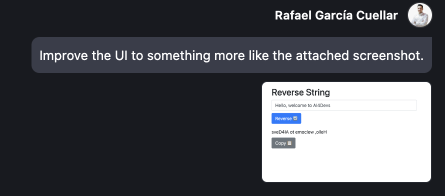

# Prompt 1
Crea una página web con lógica en javascript que invierta el orden de una cadena de texto.

Ejemplo: si introduzco AI4Devs devuelve sveD4AI.

Hazlo apoyado en el seed html+js que proporcionamos dentro de la carpeta template.

Utiliza un chatbot, como ChatGPT, Gemini o Claude, no un asistente de código en IDE como Github Copilot.

# Prompt 2
Improve the UI to something more like the attached screenshot.

